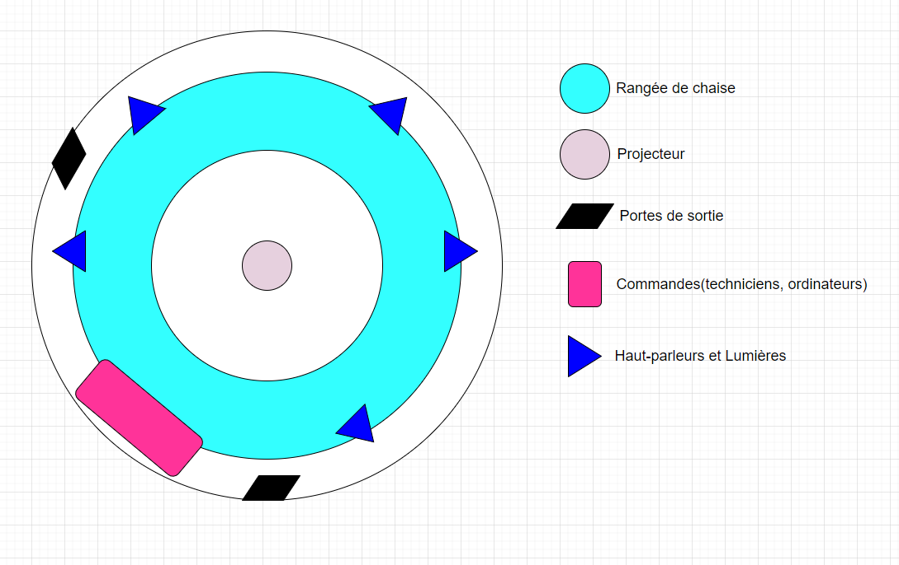
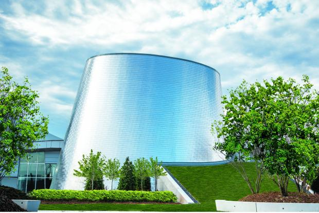
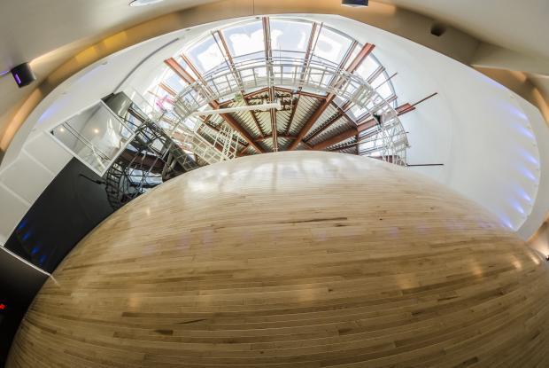
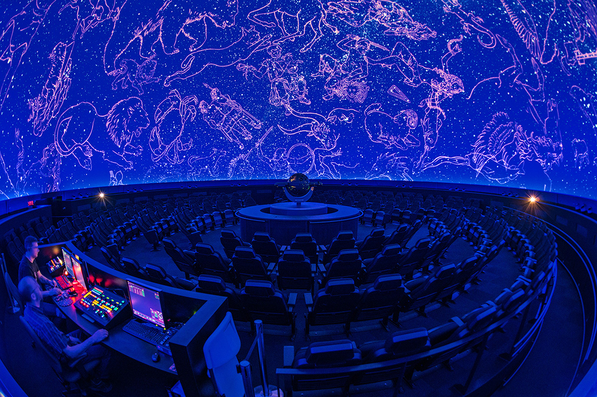
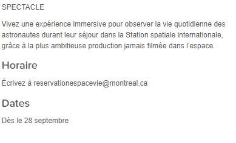
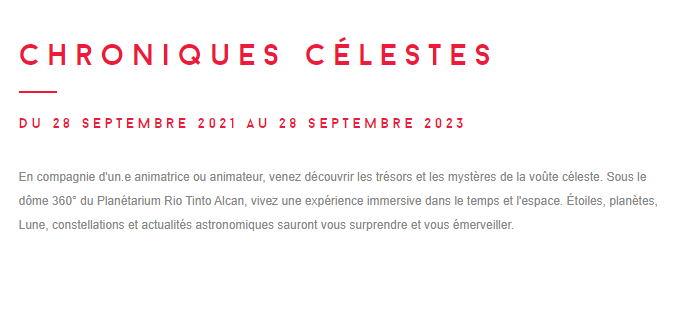

## Titre de l'oeuvre ou de la réalisation
Chroniques Célestes et Voyageurs Stellaires

## Nom de l'artiste ou de la firme
Félix et Paul Studios

## Année de réalisation
Septembre 2021

## Nom de l'exposition ou de l'événement
Chroniques Célestes et Voyageurs Stellaires

## Lieu de mise en exposition
Planétarium Rio Tinto Alcan à Montréal

## Info sur le lieu
«[...]Le Planétarium Rio Tinto Alcan intègre les critères les plus élevés du développement durable. Il utilise des technologies de pointe pour faire vivre une expérience inédite de l'Univers à travers ses théâtres immersifs où sont diffusés des spectacles à la fois poétiques et scientifiques. Ses expositions enrichissent ce parcours cosmique.» Tiré du site Internet des Musées de Montréal

## Date de votre visite
Le 15 avril 2022

## Description de l'oeuvre ou du dispositif multimédia
L' exposition « Les Chroniques Célestes et Voyageurs Stellaires» est une présentation immersive de 1 heure. La présentation était divisée en deux parties. Pour la première partie, Les Chroniques Célestes, on nous présentait les planètes de notre système solaire et leurs caractéristiques, les constellations et les différents univers. Pour la deuxième partie, Voyageurs Stellaires, on nous présentait le quotidien des astronautes qui vivaient dans des stations spatiales et leurs défis.

## Explications sur la mise en espace de l'oeuvre ou du dispositif 
Il y a avait une boule au milieu de la pièce qui servait de projecteur. Le plafon servait d'écran et donc, on pouvait voir la totalité de la présentation au plafond. Le public était installé en cercle autours du projecteur. Les techniciens étaientt installés derrière un mur pour éviter qu'on voit la lumière des ordinateurs. 

## Liste des composantes et techniques de l'oeuvre ou du dispositif 
- Projecteur (boule au milieu de la pièce)
- Ordinateurs
- Haut-parleur
- Système de son
- Lumières

## Liste des éléments nécessaires pour la mise en exposition 
- Chaises

## Expérience vécue :

## Description de votre expérience de l'oeuvre ou du dispositif, de l'interactivité, des gestes à poser, etc.
J'ai bien aimé mon expérience, assiter à cette présentation m'a permis d'en apprendre un peu plus sur l'astronomie et sur la vie d'un astonautes en services. Puisque c'était une présentation immersive, le seule geste à poser c'était d'écouter la présentateur.

## Ce qui vous a plu, vous a donné des idées et justifications
J'ai bien aimé le fait que la projection soit sur le plafond et non sur un simple écran normal. Ça donnait vraiment l'impression qu'on était couché et on regardait les étoiles. 

## Aspect que vous ne souhaiteriez pas retenir pour vos propres créations ou que vous feriez autrement et justifications
J'ai généralement bien aimé l'ensemble de l'oeuvre. Je dirais les seuls points négatifs étaint la qualité des images et les chaises. Premièrement, les images de la projection était vraiment de mauvaise qualité, elles étaient floues et ça donnait mal au yeux. Deuxièment, les chaises étaient vraiment pas comfortables et la disposition de celles-ci n'aidait pas du tout. Il fallait constament se retourner pour suivre les explications à l'écran. Je pense que mettre des «pouf» aurait été une meilleur idée. Le visiteur pourrait voir la totalité de l'écran sans à avoir à se retourner constamment ainsi, il serait plus comfortable.

Liens avec autres oeuvres et expériences multimédias découvertes cette session
Cette installation m'a beaucoup fait penser à l'oeuvre «Le Fleuve», un art qu'on a visité à l'exposition de Béchard Hudon à la Maison des Arts en mars 2022. Ces deux oeuvres se ressemblent énormément, il suffit tout simplement de regarder la présentation sans à avoir besoin d'interagir avec elles. Les deux sont des présentations immersives.

## Références

 photographies et croquis à intégrer
 
 
 photographie de l'oeuvre ou du dispositif dans son ensemble
 
 
 
 
 photographie du cartel ou du panneau explicatif
 
 
 
 

