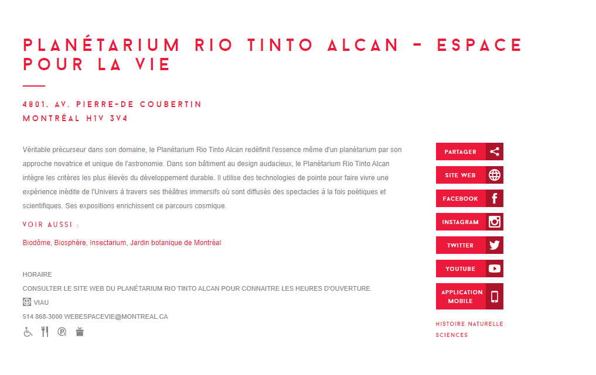

*Introduction* :
- [ ] Quel est l'objectif de votre communication (sujet posé = présentation oeuvre + expérience)
- Présenter l'exposition que je suis allée voir au Planétarium, Chroniques Célestes et Voyageurs Stellaires
- J'ai vraiment aimé mon expérience, j'en ai appris plus sur notre système solaire comme les planètes et leur satelites, les différentes constellations, les milliards     d'univers qui existent. À quoi ressemble le quotidien des astronautes qui vivent dans l'espace et leurs difficultés.
- [ ] Quels aspects seront abordés ? (sujet divisé = les différents points du développement)
-Information sur l'oeuvre
-Description de l'oeuvre
-Expérience vécue
-Critique sur l'oeuvre
-Lien avec d'autres oeuvres

*Développement* :
- [ ] Informations sur l'oeuvre et le lieu d'exposition (Titre, Nom de l'artiste, Année de réalisation, Nom de l'exposition ou de l'événement, Lieu de mise en exposition + Infos sur le lieu, Date de votre visite)
- Titre + nom de l'exposition : Chroniques Célestes et Voyageurs Stellaires
- Nom de la firme : Félix et Paul Studios
- Année de réalisation : Septembre 2021
- Lieu de mise en exposition : Planétarium à Montréal
- Infos sur le lieu : «Véritable précurseur dans son domaine, le Planétarium Rio Tinto Alcan redéfinit l'essence même d'un planétarium par son approche novatrice et     unique de l'astronomie. Dans son bâtiment au design audacieux, le Planétarium Rio Tinto Alcan intègre les critères les plus élevés du développement durable. Il utilise des technologies de pointe pour faire vivre une expérience inédite de l'Univers à travers ses théâtres immersifs où sont diffusés des spectacles à la fois poétiques et scientifiques. Ses expositions enrichissent ce parcours cosmique.» Tiré du site web des Musées de Montréal

- Date de visite : 15 avril 2022

- [ ] Présentation détaillée de l'oeuvre (description, mise en espace, composantes, éléments)
- Description : C'est une présentation numérique qui se déroule dans un théatre au Planétarium. La pièce est en forme cercle et un écran énorme est intallé sur tout le plafond. Il y a un projecteur installé au milieu de la place qui projette la présentation sur l'écran. Il y a du son qui sort des haut-parleurs installés tout au tour de la pièce.
- Composantes : Haut-parleurs, projecteurs, ordinateurs

- [ ] Expérience vécue (Description de votre expérience de l'oeuvre ou du dispositif, de l'interactivité/contemplation/immersion, des gestes à poser, etc)
- Expérience : J'ai vraiment aimé mon expérience. Il suffisait tout simplement de s'asseoir et d'écouter l'instructeur faire la présentation. Au fur et à mesure que    celui-ci expliquait, il fallait suivre ce qu'il disait à l'écran.
-
- [ ] Appréciation critique et **justifications** (Ce qui vous a plu, vous a donné des idées + Aspect que vous ne souhaiteriez pas retenir pour vos propres créations ou que vous feriez autrement)
- Critique : Durant la présentation, il fallait toujours se retourner pour voir la projection et après un certain moment ça devenait vraiment incomfortable. Je pense que le plus gros problème était la façon dont les chaises étaient disposées dans la salle. Je mettrais des chaises qui peuvent pivoter sur elle-même pur qu'ainsi on puisse toute la présentation sans à avoir un torticolis.
- 
-  [ ] Liens avec autres oeuvres et expériences multimédias découvertes cette session
- Lien : l'oeuvre à laquelle j'ai pensé durant l'exposition est «Le Fleuve», un art qu'on a visité à l'exposition de Béchard Hudon à la Maison des Arts en mars 2022. Ces deux oeuvres se ressemblent énormément, il suffit tout simplement de regarder les oeuvres sans à avoir besoin d'interagir avec elles. Les deux sont des présentations numériques présentées à l'aide de projecteurs et de haut-parleurs.

*Conclusion* :
- [ ] Rappel des aspects présentés
- Rappel des points général dans le développement
- [ ] Ouverture : élément inspirant retenu parmi toutes les oeuvres et expériences de la session
